# No Cap Your Honor ⚖️

<div align="center">


**AI-Powered Courtroom for Misinformation Detection**

*Submit suspicious content and watch AI agents battle it out in a dramatic trial*

[Demo](#-demo) • [Features](#-features) • [Quick Start](#-quick-start) • [Documentation](#-documentation)

</div>

---

## 🚨 The AI Misinformation Crisis

We're living in an era where:
- **Deepfakes are indistinguishable** from reality - AI-generated videos, images, and audio can fool even experts
- **Viral misinformation spreads 6x faster** than truth on social media
- **73% of Americans** have encountered fake news that seemed completely real
- **Generative AI** makes creating convincing fake content easier than ever

**The problem isn't just detecting lies—it's teaching people to think critically when persuasive fake content is designed to manipulate emotions.**

## 🎯 Our Solution

The Unreliable Narrator transforms fact-checking into an **engaging courtroom drama** where AI agents debate the credibility of suspicious content. Built for **HackNC State 2026**, this project:

✅ **Analyzes multimodal content** - Text, URLs, images, and videos  
✅ **Educates through engagement** - Learn manipulation tactics while watching the trial  
✅ **Builds critical thinking** - Understand *why* content is fake, not just *that* it's fake  
✅ **Scales with AI** - Instant analysis powered by multiple AI models  
✅ **Transparent reasoning** - See the evidence and arguments, not just a verdict  

### Why Courtroom Drama?

Traditional fact-checkers are boring. We make it **entertaining and educational**:
- 🎭 **Engaging**: Watch AI agents battle in real-time
- 🧠 **Educational**: Learn red flags and manipulation tactics
- 🔍 **Transparent**: See all evidence and reasoning
- ⚡ **Fast**: Get verdicts in seconds with fast-track mode

---

## 🏗️ System Architecture

```mermaid
flowchart TD
    User[User / Browser]
    
    User -->|Submits Content| Frontend[React Frontend]
    
    Frontend -->|POST /api/trial/start| API[FastAPI Backend]
    Frontend <-->|SSE Stream| API
    
    API -->|Orchestrates| LangGraph[LangGraph Workflow]
    
    LangGraph -->|Extract Claims| Gemini[Google Gemini API]
    LangGraph -->|Web Search| Internet((Internet))
    LangGraph -->|Generate Arguments| Groq[Groq API - Llama]
    LangGraph -->|Text-to-Speech| ElevenLabs[ElevenLabs API]
    
    Internet -->|Store Evidence| VectorDB[(Vector Storage)]
    
    LangGraph -->|Route Mode| Router{Mode?}
    
    Router -->|Courtroom| Trial[Trial Simulation]
    Router -->|Fast-Track| FastTrack[Quick Analysis]
    
    Trial -->|5 Rounds| Debate[Prosecutor ↔ Defender]
    Debate -->|Strategic Evidence| VectorDB
    
    Trial --> Jury[Multi-Model Jury]
    FastTrack --> Jury
    
    Jury -->|Deliberate| Models[Gemini + Groq + Llama]
    Models -->|Vote| Verdict[Verdict Aggregator]
    
    Verdict -->|Generate Insights| Education[Education Panel]
    
    Education -->|Display Results| Frontend
    Verdict -->|Show Verdict| Frontend
    
    VectorDB -.->|Auto-Delete| Cleanup[Ephemeral Cleanup]
```



**Key Flow:**
1. 📥 **Input** → User submits content via React frontend
2. 🔧 **Processing** → LangGraph orchestrates AI agents (Gemini, Groq)
3. 💾 **Storage** → Vector database stores evidence temporarily
4. 🎙️ **Voice** → ElevenLabs generates speech for courtroom arguments
5. ⚖️ **Analysis** → Courtroom trial OR fast-track verdict
6. 🎨 **Output** → Real-time streaming UI with educational insights

## ✨ Features

### 🎭 Dual Analysis Modes

| **⚖️ Courtroom Simulation** | **⚡ Fast-Track Verdict** |
|------------------------------|---------------------------|
| Full dramatic trial with prosecutor & defender | Instant AI analysis for quick checks |
| 5 rounds of strategic argumentation | Single-pass verdict generation |
| Multi-model jury deliberation | Streamlined evidence evaluation |
| Educational breakdown of tactics | Key findings summary |

### 🤖 Multi-Agent Architecture
- **Investigator**: Gathers neutral evidence from web sources
- **Prosecutor**: Argues content is misinformation
- **Defender**: Steel-mans the content's legitimacy  
- **Jury Panel**: 3-5 AI models deliberate independently (Gemini, Groq, Llama)

### 🎨 Immersive Experience
- Real-time streaming courtroom interface
- Courtroom-themed UI with parchment aesthetics
- Animated arguments and evidence reveals
- Educational "red flags" breakdown

---

## 🚀 Quick Start

### Prerequisites
- Python 3.9+
- Node.js 16+
- API Keys: [Google Gemini](https://makersuite.google.com/app/apikey) (required), [ElevenLabs](https://elevenlabs.io) (provided by MLH)

### Installation

```bash
# Clone the repository
git clone https://github.com/pranshavpatel/hackncstate_unstable_diffusers.git
cd hackncstate_unstable_diffusers

# Backend setup
cd backend
python -m venv venv
source venv/bin/activate  # Windows: venv\Scripts\activate
pip install -r requirements.txt
cp .env.example .env
# Add your API keys to .env
python main.py

# Frontend setup (new terminal)
cd frontend
npm install
npm start
```

Visit `http://localhost:3000` and start your first trial!

---

## 📖 Documentation

### 🎬 Multimodal Content Processing

The Unreliable Narrator analyzes **all types of content** to combat modern misinformation:

| Input Type | Processing Pipeline | Example Use Case |
|------------|---------------------|------------------|
| **📝 Text** | Direct claim extraction | Social media posts, news articles |
| **🔗 URL** | Web scraping → text extraction | Suspicious websites, blog posts |
| **🖼️ Image** | OCR + visual analysis | Memes, fake screenshots, manipulated photos |
| **🎥 Video** | Transcription + frame analysis | Deepfakes, misleading clips, viral videos |

**Why multimodal matters:** Modern misinformation often combines text, images, and video to maximize emotional impact and credibility.

---

### API Keys Configuration

| Service | Required | Purpose | Get Key |
|---------|----------|---------|---------|
| Google Gemini | ✅ Yes | Primary LLM for all agents | [Get Key](https://makersuite.google.com/app/apikey) |
| ElevenLabs | ⚪ Optional | Text-to-speech for courtroom | [Get Key](https://elevenlabs.io) - Provided by MLH |
---

## 🛠️ Tech Stack

### Backend Stack
| Technology | Purpose | Key Features |
|------------|---------|--------------|
| **LangGraph** | Multi-agent orchestration | State machine workflow, conditional routing |
| **FastAPI** | REST API + SSE streaming | Async endpoints, CORS support, real-time events |
| **Google Gemini 2.5** | Primary LLM | Flash for speed, Pro for reasoning |
| **Groq** | Fast inference | Llama 3 models for jury diversity |
| **ElevenLabs** | Text-to-speech | Voice synthesis for courtroom arguments |
| **Python 3.9+** | Runtime | Async/await, type hints, Pydantic models |

### Frontend Stack
| Technology | Purpose | Key Features |
|------------|---------|--------------|
| **React 18** | UI framework | Hooks, functional components, state management |
| **Framer Motion** | Animations | Page transitions, argument reveals, smooth UX |
| **Server-Sent Events** | Real-time streaming | One-way server push, auto-reconnect |
| **Axios** | HTTP client | API calls, file uploads, error handling |


### Key Technical Decisions

**Why LangGraph?**
- ✅ Built-in state management for multi-agent workflows
- ✅ Conditional routing (courtroom vs fast-track)
- ✅ Easy debugging and visualization
- ✅ Async-first design

**Why Server-Sent Events over WebSockets?**
- ✅ Simpler implementation (one-way communication)
- ✅ Auto-reconnect built-in
- ✅ Works with standard HTTP/HTTPS
- ✅ Better for streaming updates from server

**Why Ephemeral Storage?**
- ✅ Privacy-first: no data retention
- ✅ Prevents cross-contamination between trials
- ✅ Reduces storage costs
- ✅ Forces fresh analysis each time

---

## 🎓 Educational Impact: Teaching Critical Thinking

The Unreliable Narrator doesn't just tell you if content is fake—it **teaches you WHY and HOW to spot it yourself**.

### What Users Learn

After each trial, users receive an **Education Panel** that reveals:

| Red Flag Category | What You Learn | Example |
|-------------------|----------------|---------|
| **🎯 Emotional Manipulation** | How content exploits fear, anger, or outrage | "SHOCKING: They don't want you to know..." |
| **📊 Statistical Deception** | Misleading graphs, cherry-picked data | "95% of doctors agree" (sample size: 20) |
| **🔗 Source Quality** | Evaluating credibility of sources | Anonymous blog vs peer-reviewed journal |
| **🖼️ Visual Manipulation** | Spotting edited images, deepfakes | Mismatched lighting, unnatural movements |
| **⏰ Temporal Context** | Old content presented as recent | 2015 photo claimed to be from yesterday |

### Building Immunity to Misinformation

**Traditional fact-checkers:** "This is false."  
**The Unreliable Narrator:** "This is false BECAUSE it uses emotional manipulation, cherry-picked data, and anonymous sources. Here's how to spot these tactics next time."

By watching AI agents debate and reveal evidence, users develop:
- 🧠 **Critical thinking skills** - Question before sharing
- 🔍 **Source evaluation** - Check credibility automatically  
- 🎭 **Manipulation awareness** - Recognize emotional triggers
- 📚 **Media literacy** - Understand how misinformation spreads

**The goal:** Make users harder to fool, even when we're not there.

---

## 👥 Team
- **Pranshav Patel**
- **Janam Patel**
- **Namit Patel**
- **Vivek Vanera**

*HackNC State 2026 Participants*

---

## 📄 License

This project is licensed under the MIT License

---

## 🌟 Contributing

We welcome contributions! This project aims to combat misinformation through:
- **Education**: Teaching media literacy through engagement
- **Transparency**: Open-source AI fact-checking
- **Accessibility**: Free tools for everyone

To contribute:
1. Fork the repository
2. Create a feature branch (`git checkout -b feature/amazing-feature`)
3. Commit your changes (`git commit -m 'Add amazing feature'`)
4. Push to the branch (`git push origin feature/amazing-feature`)
5. Open a Pull Request

---

## 🙏 Acknowledgments

- **Google Gemini** for powerful LLM capabilities
- **ElevenLabs** for text-to-speech API (provided by MLH)
- **Major League Hacking (MLH)** for ElevenLabs API credits
- **LangGraph** for multi-agent orchestration framework
- **HackNC State 2026** for the opportunity to build this project
- The open-source community for amazing tools and libraries

---

## 📞 Contact & Support

- **Issues**: [GitHub Issues](https://github.com/pranshavpatel/hackncstate_unstable_diffusers/issues)
- **Discussions**: [GitHub Discussions](https://github.com/pranshavpatel/hackncstate_unstable_diffusers/discussions)

---

<div align="center">

**Made with ⚖️ for a more informed world**

*Combating misinformation, one trial at a time*

</div>
